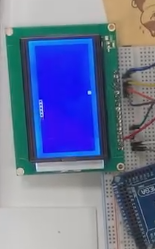

# Arduino-gameboy

這是一個使用 **Arduino 和 LCD12864（ST7920 控制器） 的專案。

## 🔧 使用元件

- Arduino UNO
- LCD12864-ST7920core (SPI 模式)
- 10k Potentiometer
- Breadboard and jump wires

🖼️ 專案展示

## 📜 功能說明

- 貪食蛇遊戲 -含速度調節與計分版
- 西洋棋遊戲
- 支援遊戲選單
- 動畫效果
- 調整亮度 via potentiometer

## 🧠 使用的函式庫

- `U8g2` - 用於簡單顯示圖文資訊（支援 ST7920 控制器）
- `SPI.h`

## 🚀 開始使用

### 1. 環境準備

- 安裝 Arduino IDE
- 安裝 U8g2 函式庫（管理員中搜尋安裝）

### 2. 燒錄範例程式碼

